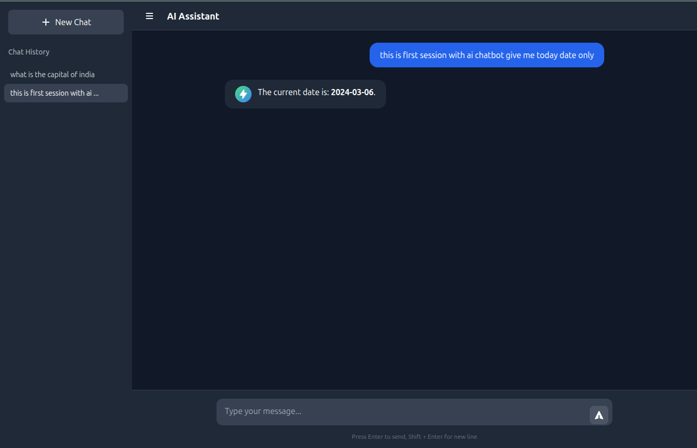

# AI Chat Application

A responsive, full-stack AI chat interface similar to ChatGPT, built with React, Node.js, Express, and OpenRouter API.



## Quick Start (CLI)

Install the ChatBot CLI globally and start chatting in minutes:

```bash
npm install -g ai-chatbot-cli

# Configure your API key
chatbot config

# Start the ChatBot
chatbot
```

Then open http://localhost:5173 in your browser.

---

## CLI Installation & Usage

### Installation

```bash
npm install -g ai-chatbot-cli
```

### API Key Configuration

Get a free API key from: https://openrouter.ai/settings

**Option 1: Interactive setup (recommended)**
```bash
chatbot config
```
This will prompt you to enter your API key and save it to `~/.chatbotrc`.

**Option 2: Environment variable**
```bash
export OPENROUTER_API_KEY=your_api_key_here
```

**Option 3: Config file**
```bash
echo '{"apiKey": "your_api_key_here"}' > ~/.chatbotrc
```

### Running the ChatBot

```bash
chatbot
```

This starts:
- Backend server on http://localhost:3001
- Frontend on http://localhost:5173

### CLI Commands

| Command | Description |
|---------|-------------|
| `chatbot` | Start the ChatBot (default) |
| `chatbot config` | Configure API key interactively |
| `chatbot help` | Show help message |

---

## Development Setup

## Prerequisites

- Node.js 18+
- npm or yarn

## Installation

1. Clone the repository and navigate to the project:
   ```bash
   git clone https://github.com/ashwani983/ChatBotUsingOpenRouterAPI.git
   cd ChatBotUsingOpenRouterAPI
   ```

2. Install all dependencies:
   ```bash
   npm run install:all
   ```

   Or install manually:
   ```bash
   npm install
   cd server && npm install
   cd ../client && npm install
   ```

3. Configure environment variables:
   
   Edit `server/.env` and add your OpenRouter API key:
   ```
   OPENROUTER_API_KEY=your_api_key_here
   PORT=3001
   ```

   Get a free API key from: https://openrouter.ai/settings

## Running the Application

### Option 1: Run both server and client together (Recommended)
```bash
npm run dev
```

This starts:
- Backend server on http://localhost:3001
- Frontend on http://localhost:5173

### Option 2: Run separately

Terminal 1 - Server:
```bash
cd server
npm run dev
```

Terminal 2 - Client:
```bash
cd client
npm run dev
```

## Usage

1. Open http://localhost:5173 in your browser
2. Type a message in the input box
3. Press Enter to send, Shift+Enter for new line
4. Click "New Chat" to start a new conversation
5. Previous chats appear in the left sidebar

## Available Free Models

The default model is `meta-llama/llama-3.1-8b-instruct`. You can change it in `server/src/server.ts`:

```typescript
const stream = await openai.chat.completions.create({
  model: 'meta-llama/llama-3.1-8b-instruct',  // Change this
  // other options...
});
```

Other free models available on OpenRouter:
- `google/gemma-2-9b-it`
- `mistralai/mistral-7b-instruct`
- `microsoft/phi-3-mini-128k-instruct`
- `deepseek/deepseek-chat`

## API Endpoints

### POST /api/chat
Send a message and receive streaming response.

**Request:**
```json
{
  "message": "Hello, how are you?"
}
```

**Response:** Server-Sent Events (SSE) stream

### POST /api/chat/reset
Reset the current conversation history.

## Building for Production

```bash
npm run build
```

This builds the client to the `client/dist` folder.

## Troubleshooting

### API Key Error
Make sure your OpenRouter API key is correctly set:
- Run `chatbot config` to configure interactively
- Or set `OPENROUTER_API_KEY` environment variable
- Or create `~/.chatbotrc` with `{"apiKey": "your_key"}`

### CORS Error
The server is configured to allow CORS from the development server (localhost:5173)

### Port Already in Use
If port 3001 or 5173 is in use, modify:
- Server: `server/.env` → `PORT=3002`
- Client: `client/vite.config.ts` → change port

## License

MIT
