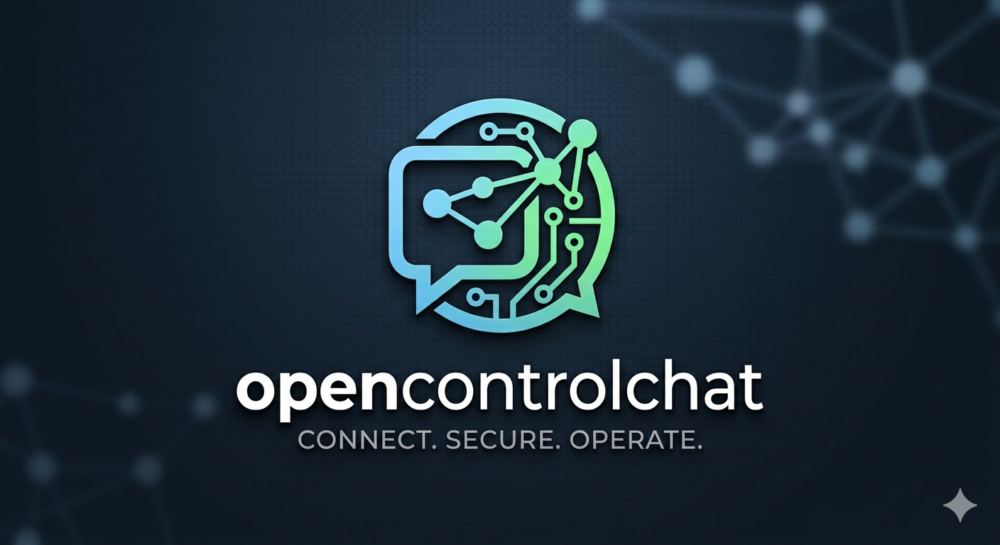

# OpenControlChat (occhat)

A responsive, full-stack AI chat interface similar to ChatGPT, built with React, Node.js, Express, and OpenRouter API.



[](https://www.npmjs.com/package/occhat)
[](https://www.npmjs.com/package/occhat)
[](https://opensource.org/licenses/MIT)

## Features

### Core Features
- **Multi-Model Support** - Switch between Llama, Gemma, Mistral, Phi-3, DeepSeek
- **User API Key** - Users provide their own OpenRouter API key (no server key needed)
- **Streaming Responses** - Real-time AI responses
- **Persistent Chat** - SQLite database for conversation history

### Canvas Editor
- **Monaco Editor** - Full-featured code editor with syntax highlighting
- **Multi-Language Support** - JavaScript, HTML, CSS
- **Live Preview** - See your code run in real-time

### Vision (Image Analysis)
- **AI Image Analysis** - Free NVIDIA vision model
- **Drag & Drop** - Easy image upload

### File Handling
- **File Upload** - PDF, images, code files
- **File Preview** - View before downloading

### Sharing
- **Share Conversations** - Generate unique links

### Voice Features
- **Voice Input** - Click the microphone to speak
- **Text-to-Speech** - AI responses read aloud
- **Multiple Languages** - 10+ interface languages

### Export & Search
- **Conversation Search** - Find by title or content
- **Export Options** - Markdown, Text, or PDF

### UI Enhancements
- Dark/Light theme
- Toast notifications
- Keyboard shortcuts

---

## Install (CLI)

```bash
npm install -g occhat

# Configure your API key
occhat config

# Start OCCChat
occhat
```

Then open http://localhost:3001 in your browser.

---

## Configuration

Get a free API key from: https://openrouter.ai

**Interactive (Recommended):**
```bash
occhat config
```

**Environment Variable:**
```bash
# Linux/macOS
export OPENROUTER_API_KEY=your_api_key_here
```

---

## CLI Commands

| Command | Description |
|---------|-------------|
| `occhat` | Start the OCCChat server |
| `occhat start` | Start the OCCChat server |
| `occhat stop` | Stop the running server |
| `occhat status` | Show server status |
| `occhat restart` | Restart the server |
| `occhat config` | Configure API key interactively |
| `occhat help` | Show help message |

**Options:**
- `--port <number>` - Specify port (default: 3001)

---

## Development Setup

### Prerequisites
- Node.js 18+
- npm

### Installation

1. Clone the repository:
```bash
git clone https://github.com/ashwani983/ChatBotUsingOpenRouterAPI.git
cd ChatBotUsingOpenRouterAPI
```

2. Install dependencies:
```bash
cd server && npm install
cd ../client && npm install
```

3. Build:
```bash
npm run build
```

4. Run:
```bash
npm run dev:server
npm run dev:client
```

Or run the CLI:
```bash
npm link
occhat
```

Open http://localhost:3001 in your browser.

---

## Available Free Models

The default model is `meta-llama/llama-3.1-8b-instruct`. You can change it in Settings.

Other free models:
- `google/gemma-2-9b-it`
- `mistralai/mistral-7b-instruct`
- `microsoft/phi-3-mini-128k-instruct`
- `deepseek/deepseek-chat`

---

## Keyboard Shortcuts

- `Enter` - Send message
- `Ctrl+Enter` - New line
- `↑/↓` - Navigate input history
- `Ctrl+Shift+N` - New conversation
- `Escape` - Close modal
- `?` - Show shortcuts

---

## License

MIT